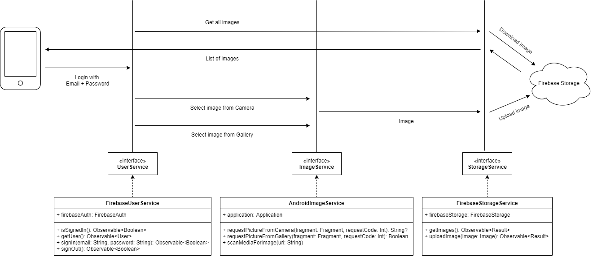

Simple apps to showcasing Firebase Storage + Firebase Authentication.

#1 Create Android Firebase Project with package name: com.bonioctavianus.android.instafake.

#2 Download 'google-services.json' file for that project.

#3 Put 'google-services.json' file in the 'app' directory, then build the project.

Flow Diagram

